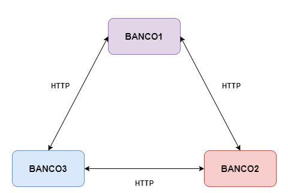

# TEC502-PBL02
Problema 2 da matéria TEC502 - Concorrência e Conectividade: Transações Bancárias Distribuídas.

### Sumário 
+ [Como Executar](#como-executar-a-solução)
+ [Introdução](#introdução)
+ [Produto Desenvolvido](#produto-desenvolvido)
+ [Gerenciamento de Contas](#gerenciamento-de-contas)
+ [Comunicação](#protocolo-de-comunicação)
+ [Algoritmo de Concorrência](#algoritmo-de-concorrencia)
+ [Tratamento da Confiabilidade](#tradatamento-da-confiabilidade)

## Como Executar:

A solução para o problema, como requerida, está no formato de um imagem Docker. Assim, para que seja feito o uso da solução é necessário possuir o Docker instalado na máquina e executar os seguintes comandos:

Execute o seguinte comando para obter a imagem do servidor:
```bash
docker pull yxngnd/bank_server:latest
```
Execute a imagem e substitua os campo *bankx_host* pelo ip do server de cada banco, o formato do ip deve sero seguinte: ip:port, substitua também o campo *port* pela porta que o servidor estará rodando, é necessário que a porta do campo *port* seja a mesma que está no host do banco.
```bash
docker run -it -p port:port -e PORT="port" -e BANK1="bank1_host" -e BANK2="bank2_host" -e BANK3="bank3_host" yxngnd/bank_server
```

## Introdução

É notável o crescimento do número de clientes de bancos que têm dado preferência pelo uso de serviços bancários em dispositivos móveis, tanto pela praticidade, quando pela facilidade. Com isso, em 2020 foi desenvolvido e lançado o Pix, pelo Banco Central do Brasil, uma plataforma de pagamento que permite uma rápida execução de pagamentos e transferências através de serviços de banco online. Tendo isso em mente, foi solicitado o desenvolvimento de uma plataforma que, de forma semelhante ao pix, permitisse que transferências fossem feitas de forma mais fácil em um consórcio de bancos descentralizados, ou seja, em uma situação onde não existe um banco central para fazer o gerenciamento dos mesmos.

A solução para o produto possui alguns requerimentos: a capacidade de criação de contas, onde poderia ser feito depósito e saque para a mesma, a visualização de todas as contas vinculadas ao cpf que está logado no momento, independente de qual dos bancos do consórcio ela está, e a realização de transferências para qualquer conta do consórcio, podendo até mesmo selecionar mais de uma conta do mesmo cliente para que seja dividido o valor total que seria transferido ou destinatário.    

O sistema em si foi desenvolvido por completo utilizando a linguagem de programação C++, fazendo uso da biblioteca **Crow** para desenvolver a API com auxílio da biblioteca **httplib** para algumas requisições *HTTP* internas. Por fim, a interface da aplicação foi desenvolvida com HTML, CSS e JavaScript.

## Produto Desenvolvido

O produto finalizado finalizado consiste em um servidor que faz todo gerenciamento das entidades *Account* e *Bank*, funcionando como uma API Restful, disponibilizando rotas e lidando com as requisições feitas pelo cliente através de uma interface. O consórcio, que é a comunicação feita entre três servidores, consite em três bancos que comunicam-se entre si através do protocolo HTTP utilizando endereços já conhecidos por cada um deles.



- **Figura 1:** *Diagrama da comunicação entre os bancos.*

## Gerenciamento de Contas
Para fazer o gerenciamento de contas foram implementadas as funcionalidades de cadastro, login, depósito, saque e transferência, acessadas através de requisições na API, possibilitando que o cliente crie e acesse suas contas através da interface da aplicação, além de manipular o saldo das contas ao retirar, adicionar ou transferir dinheiro para outra conta.

O sistem faz uso de uma tela única para que o cliente faça o gerenciamento das suas contas, nessa tela é exibida cada conta que o cliente possui vinculada ao seu CPF, independente de qual banco esteja, as operações de saque e depósito são feitas apenas na conta do banco que o cliente está logado no momento, porém, na operação de transferência o cliente pode selecionar uma ou mais de suas contas, junto ao valor que vai ser retirado de cada uma delas para que seja enviado à conta destino.

## Comunicação

Para fazer a comunicação tanto da interface com o servidor do banco, quanto a comunicação entre banco foi utilizado o protocolo HTTP, um define os padrões para troca de dados entre programas de aplicação, essenciais para comunicação feita entre aplicaçãos em diferentes dispositivos, sendo desenvolvida uma API Restful, permitindo que sejam feitas requisições à API através da interface do cliente. Ao realizar alguma das operações na interface, uma solicitação é enviada a API e o servidor fica responsável por fazer o tratamento adequado e retornar uma mensagem de confirmação que pode ou não retornar dados, ou uma mensagem de erro em caso de falha de uma das operações.

As rotas desenvolvidas para cada uma das operações estão demonstradas na tabela a seguir:

| Rota          | Método        | Envio         | Resposta      |   
| ------------- | ------------- | ------------- | ------------- |
| "/login"      |      POST     |JSON: {"cpf": string, "password": string}|status: 200 - JSON: {"name": string, "cpf": string, "type": boolean, "balance": double} <br /> status: 400 <br /> status: 401 - message: "Invalid credentials"|
| "/register"   |      POST     |JSON: {"name": string, "cpf": string, "type": boolean, "password": string}|status: 200 - message: "Account created successfully"  <br /> status: 400  <br /> status: 400 - message: "Error when creating account"|
| "/account/cpf"|      GET      |PARAMS: cpf=string|status: 200 - JSON: {[{"cpf": string, "bank": string, "balance": double}]}|
| "/accounts"   |      GET      |PARAMS: cpf=string|status: 500 - message: "Invalid JSON response from bank"  <br /> status: 200 - JSON: {["bank_name": string, "account": {"cpf": string, "bank": string, "balance": double}]}  <br /> status: 404 - message: "No accounts found in consortium for the given CPF"|
| "/deposit"    |      POST     |JSON: {"cpf": string, "value": double}|status: 400 - message: "Invalid JSON" <br /> status: 200 - message: "Deposit make with success"  <br /> status: 404|
| "/withdraw"   |      POST     |JSON: {"cpf": string, "value": double}|status: 400 - message: "Invalid JSON"  <br /> status: 200 - message: "withdraw make with success"  <br /> status: 404|
| "/transfer"   |      POST     |JSON: {"senders": [{"cpf": string, "bank": string, "balance": double}], "receiver": {"cpf": string, "bank": string,"value": double}}|status: 200 - message: "Transfer completed successfully"  <br /> status: 400  <br /> status: 404 - message: "Transfer cannot be completed: deposit failed"|

### Descrição das rotas

-  */login*: Rota utilizada para fazer o login, recebe um JSON contendo o CPF e a senha do usuário, caso o CPF e senha existam no banco, o usuário é redirecionado para a rota */accounts*, caso algum dado esteja incorreto o usuário é informado do erro.
-  */register*: Rota utilizada para fazer o registro do cliente, recebe um JSON contendo nome, CPF, senha e tipo da conta (individual ou conjunta), caso selecione conjunta o CPF continua sendo enviado numa string única no formato "cpf1&cpf2", se o registro for um sucesso o usuário é informado que sua cotna foi criada e é redirecionado para a tela inicial *"/"*, se caso o cpf já estiver registrado, o usuário é informado do erro e a conta não é criada.
-  */account/cpf*: Rota auxiliar utilizada para recuperar todas as conta, uma individual e **n** contas conjuntas que o cliente pode ter num determinado banco.
-  */accounts*: Rota que retorna todas as contas que estão vinculadas a um determinado CPF em todos os bancos do consórcio, faz uma requisição GET na rota *"/account/cpf"* de cada banco, recuperando as contas e colocando-as numa lista e enviando a lista como resposta para a interface.
-  */deposit*: Rota responsável pelo depósito na conta que está logada, recebe um JSON contendo CPF e valor, retornando a resposta de confirmação de depósito ou de erro caso haja alguma falha.
-  */withdraw*: Rota responsável pelo saquena conta que está logada, recebe um JSON contendo CPF e valor, retornando a resposta de confirmação de saque ou de erro caso haja alguma falha, como saldo insuficiente.
-  */transfer*: Rota responsável por fazer toda a parte de transferência de saldo das contas, recebe um JSON contendo uma lista de contas *senders* que é uma relação de banco e conta de onde vão ser tirado o dinheiro da trnsferência e *receiver* que é as informações da conta destino do dinheiro da transferência. Dentro da rota são feitas requisições POST na rota *"/withdraw"* para cada uma das contas contidas em *senders* e uma requisição POST em *"/deposit"* para a conta contina em *receiver*. Em caso de erro é feito um gerenciamento das contas envolvidas para que o saldo não seja perdido e seja adequadamente retornado a conta origem.

## Algoritmo de Concorrência

Para evitar problemas relacionados à concorrência, foi implementado o padrão Two-phase commit(2PC) no produto, o 2PC é um algoritmo distribuído que coordena todos os processos que participam de uma transação atômica distribuída, decidindo se a transação deve ser confirmada ou abortada (revertida).

O algoritmo é implementado na operação de transferência e funciona da seguinte forma: após receber as contas que participarão da transação e verificar se todas as informações estão nos conformes, é criado uma lista de *rollback*, onde estarão armazenadas as contas que já passaram por alguma fase do processo e que por algum erro precise ser revertido, é então iniciado as fases de preparação e confirmação, durante essas fases é feito uma tentativa de retirada de saldo de cada uma das contas que estão enviando o dinheiro, após ser feita a retirada do dinheiro, a conta é adicionada na lista de *rollback*, caso uma das contas falhe por saldo insuficiente ou outro erro de comunicação, a operação é abortado e o *rolback é feito*, caso todas as operações de retirada de saldo sejam um sucesso, é feito a segunda parte da confirmação, onde é depositada o saldo na conta do receptor, caso o depósito não possa ser concluído, é feito o *rollback*, caso seja concluído é retornado a mensagem de confirmação ao cliente através da interface.

Além disso, para evitar outros problemas internos, foi utilizado um mutex nas operações do banco feitas nas contas, evintando problemas envolvendo o acesso de múltiplas threads a uma região crítica.

## Tratamento da Confiabilidade

Ao tentar fazer requisições em um banco que está desconectado, a operação não é concluída até que o banco seja conectado novamente, em caso de falha de conexão durante uma transferência é feito um *rollback* para garantir que nenhum valor seja perdido por nenhuma das contas envolvidas nas transações.
